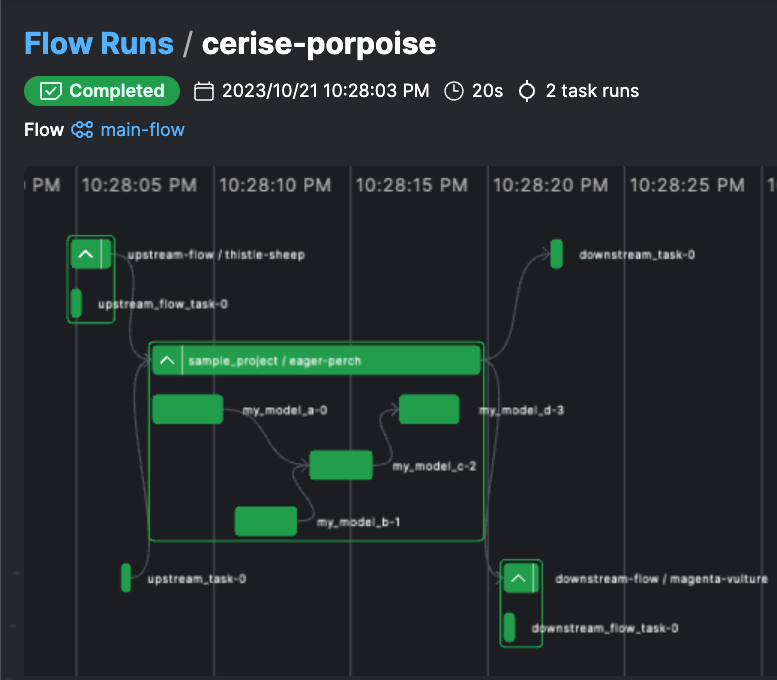

# DAG integration

You might want to integrate a `dbt_flow` with other flows or tasks. This page will show you how.

## Example

The following example shows how to integrate a `dbt_flow` with other flows or tasks.

``` python
from prefect import task, flow

from prefect_dbt_flow import dbt_flow

my_dbt_flow = dbt_flow(
    ...
)

@flow
def upstream_flow():
    @task
    def upstream_flow_task():
        print("upstream flow")

    upstream_flow_task()


@flow
def downstream_flow():
    @task
    def downstream_flow_task():
        print("downstream flow")

    downstream_flow_task()


@task
def upstream_task():
    print("upstream task")


@task
def downstream_task():
    print("downstream task")


@flow(log_prints=True)
def main_flow():
    uf_future = upstream_flow(return_state=True)
    ut_future = upstream_task(return_state=True)

    dbt_future = my_dbt_flow(wait_for=[uf_future, ut_future])

    downstream_flow(wait_for=[dbt_future])
    downstream_task(wait_for=[dbt_future])


if __name__ == "__main__":
    main_flow()
```

The code above results in the following DAG.


A full example can be found at [`examples/sample_project/my_dbt_flow_other_deps_dev.py`](https://github.com/datarootsio/prefect-dbt-flow/blob/main/examples/sample_project/my_dbt_flow_other_deps_dev.py).
