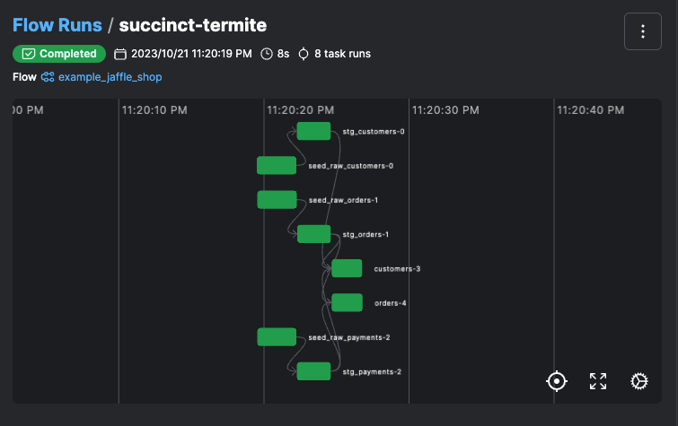

# Getting started guide

The prefect-dbt-flow library allows you to seamlessly integrate dbt workflows into Prefect. This usage guide will walk you through the steps required to create and manage a Prefect flow for the [jaffle_shop](https://github.com/dbt-labs/jaffle_shop) dbt project. After this guide, you should be able to create dbt flows for your own dbt projects.

## Example guide
This guide will walk you through setting up and running a sample prefect-dbt-flow using Docker Compose. Follow these steps to get started:

### 1. Clone this repository
Clone the prefect-dbt-flow repository and navigate to the example directory.
```bash
git clone https://github.com/datarootsio/prefect-dbt-flow.git
cd prefect-dbt-flow/example/jaffle_shop
```

### 2. Install Docker Compose
Ensure that you have Docker Compose installed on your system. If you haven't already installed it, refer to the [Docker Compose Installation Guide](https://docs.docker.com/compose/install/) for instructions.

### 3. Start the Docker Containers
The following command will launch three services defined in the docker-compose file:  

 - A PostgreSQL database,
 - A Prefect server accessible at: `http://0.0.0.0:4200/` or `http://localhost:4200/`
 - A cli environment with all the required components installed. This allows you to easily interact with the Prefect server and run Prefect flows.

```bash
docker compose up -d --build
```

### 4. Access the cli service
To access the cli service, use the following command:
```bash
docker compose run cli
```

### 5. Run the Prefect flow
Inside the cli environment, run the Prefect dbt flow using the following command:
```bash
python my_prefect_dbt_flow.py
```
This command will execute the Prefect flow and print its status to the terminal.

### 6. View the results
To view the results and monitor the flow, follow these steps:

 - Open a web browser and go to [http://0.0.0.0:4200/](http://0.0.0.0:4200/).
 - In the Prefect Server interface, click on the [flow runs tab](http://0.0.0.0:4200/flow-runs). There should be flow with a similar name to `energetic-collie`.
 - From there, you can explore the dbt job DAG and its associated logs.



With these steps, you can set up and run a prefect-dbt-flow and monitor its progress through the Prefect Server interface.

## Advanced Configuration
In the previous section, you configured your dbt project within the Prefect flow. Here's how you can customize the configuration further:

### Dbt Project Configuration
You specified the name, project directory, and profiles directory when creating the DbtProject object. Adjust these values to match your dbt project's setup.

 - `DbtProject`: Represents your dbt project configuration.
    - `name`: Name of the dbt project.
    - `project_dir`: Path to the directory containing the project.yml configuration file.
    - `profiles_dir`: Path to the directory containing the profiles.yml file.

### Dbt Profile Configuration
The DbtProfile object allows you to set the target profile for your dbt project. This profile should match the configuration in your dbt profiles.yml file.

 - `DbtProfile`: Represents the dbt profile configuration.
    - `target`: Specify the dbt target (e.g., "dev" or "prod").

### Dag Options
The DbtDagOptions object lets you define various options for your dbt workflow. In the provided example, we set run_test_after_model to True, indicating that dbt tests should run after each dbt model.

 - `DbtDagOptions`: Allows you to specify dbt DAG configurations.
    - `select`: Specify a dbt module to include in the run ([select syntax](https://docs.getdbt.com/reference/node-selection/graph-operators)).
    - `exclude`: Specify a dbt module to exclude in the run ([exclude syntax](https://docs.getdbt.com/reference/node-selection/exclude)).
    - `run_test_after_model`: Set this to True to run tests after running models.


### Prefect flow configuration
prefect-dbt-flow integrates with Prefect's monitoring and error handling capabilities. You can use Prefect features like scheduling, notifications, and task retries to monitor and manage your dbt flows effectively. You can pass this additional Prefect flow configuration options using a dictionary into: `flow_kwargs`.

For more information on these features, consult the [Prefect documentation.](https://docs.prefect.io/2.10.12/api-ref/prefect/flows/#prefect.flows.flow)

## Conclusion
prefect-dbt-flow simplifies the orchestration and management of dbt workflows within a Prefect flow. By following the steps in this guide, you can easily create and execute data pipelines that incorporate dbt projects. Be aware of breaking changes as this library is actively developed, and consult the changelog for updates. Happy data engineering! :rocket: